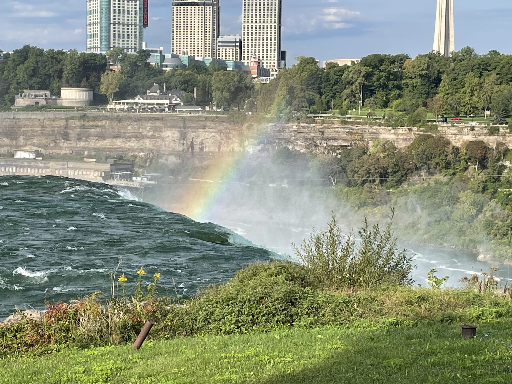

<ins>Headers</ins>

# Markdown Assignment

### DSP Course

###### Test

<ins>Emphasis</ins>

**This sentence is in bold**

_This sentence is is italicized_

<ins>Lists</ins>

## Unordered List

- Note 1
- Note 2
- Note 3

## Ordered List

1. First task
2. Second task
3. Third task

<ins>Links</ins>

[README](README.md)

[Visit freecodecamp](https://www.freecodecamp.org)

<ins>Images</ins>



<ins>Blockquotes</ins>

> This is a blockquoted text

> This is a ~~strikethrough~~ example

<ins>Incline code and code blocks</ins>

```javascript
var i = 5;
console.log("This is javascript code");
```
